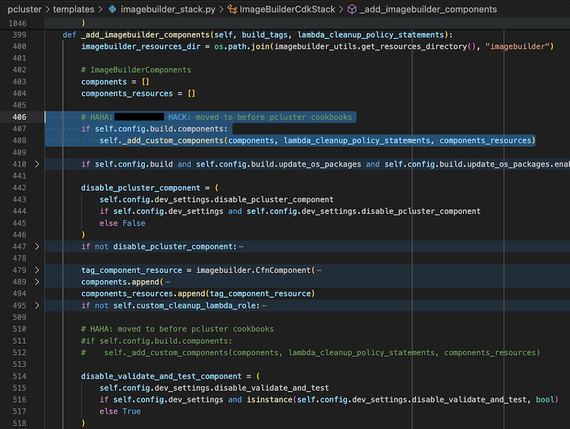
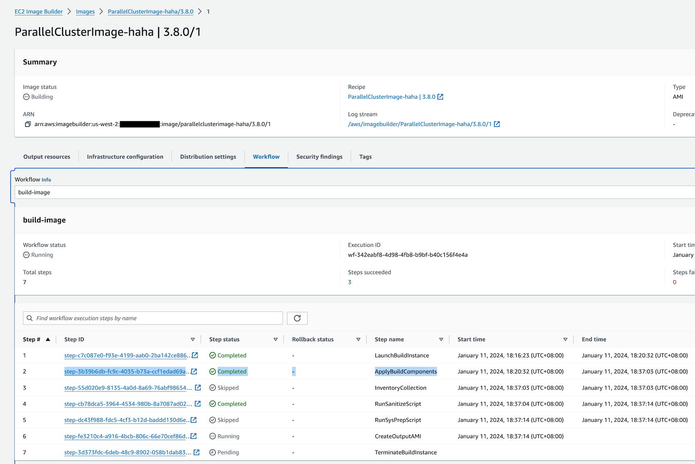
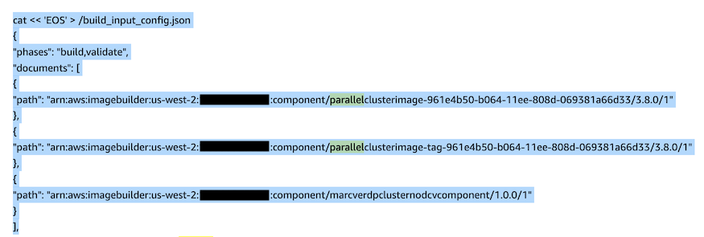
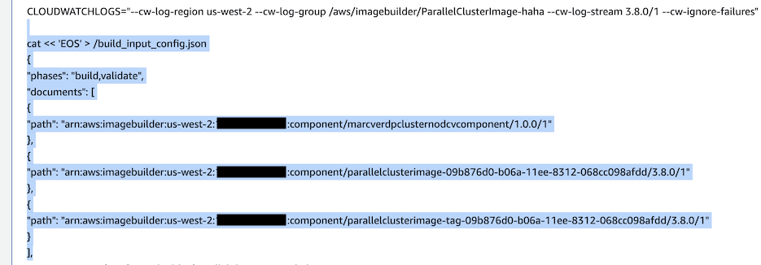

# Skip DCV installation in custom ParallelCluster AMI

Based on <https://aws.amazon.com/blogs/hpc/custom-amis-with-parallelcluster-3/>.

Pre-requisite: hack the pcluster python package, to put custom Components before ParallelCluster
components (e.g., cookbooks, etc.)



NOTE: there's a [PFR][1] for this (also see this thread on [#parallelcluster-interest][2])

[1]:
    https://aws-crm.lightning.force.com/lightning/r/Product_Feature_Request__c/a2v4z000000P5nJAAS/view
[2]: https://amzn-aws.slack.com/archives/C017LP32MN3/p1698279435377889

Then, create AMI as follows:

```bash
aws s3 cp components/fake-dcv-component.yaml s3://frameworks-shared-bucket/

# To delete an existing component
aws --region $AWS_REGION imagebuilder delete-component \
    --component-build-version-arn arn:aws:imagebuilder:us-west-2:159553542841:component/marcverdpclusternodcvcomponent/1.0.0/1

aws --region $AWS_REGION imagebuilder create-component \
    --name marcverdPclusterNoDcvComponent \
    --semantic-version 1.0.0 \
    --platform Linux \
    --uri s3://frameworks-shared-bucket/fake-dcv-component.yaml
# arn:aws:imagebuilder:us-east-1:159553542841:component/marcverdpclusternodcvcomponent/1.0.0/1
# arn:aws:imagebuilder:us-west-2:159553542841:component/marcverdpclusternodcvcomponent/1.0.0/1

# Edit dlami*.yaml, uncomment the component stanza, and update the component arn.
vi $AWS_REGION/dlami-ub2004-base-gpu.yaml

# By convention, yyyymmdd is ami name is the dlami's yyyymmdd.
pcluster build-image \
    -r $AWS_REGION \
    -c $AWS_REGION/dlami-ub2004-base-gpu.yaml \
    -i pc-dlami-ub2004-base-gpu-no-dcv-20240228 \
    | jq .

pcluster build-image \
    -r $AWS_REGION \
    -c $AWS_REGION/dlami-ub2004-pytorch-gpu.yaml \
    -i pc-dlami-ub2004-pytorch-gpu-no-dcv-20240228 \
    | jq .
```

Reminder to hack the pcluster client so that the `fake-dcv-component` precedes pcluster cookbook.
See below for comparisons.

1. How to navigate to the build step that will show what components goes to the AMI, and in what
   order.

   

1. Wrong AMI build: dcv still installed; fake dcv component not effective

  

1. Correct AMI build: dcv not installed; fake dcv component in effect.

  

## Appendix: scratch notes

* Cookbook took ~15 minutes ([log](02-nodcv-cookbook-logs.log)). Meaning, the rest of ~25 minutes
[log](01-nodcv-all-logs.log) are from Image Builder (incl. creating the new AMI snapshot.

* `pyenv install <python-version>` took only ~1.5-2 minutes.
